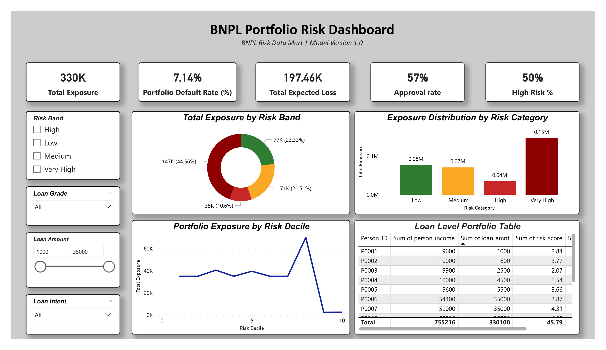
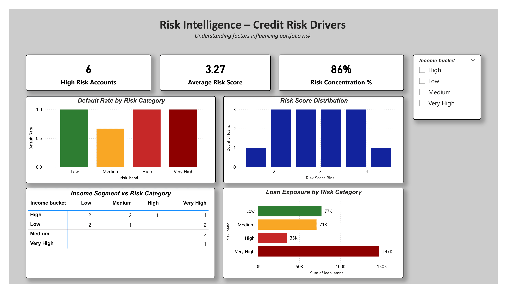
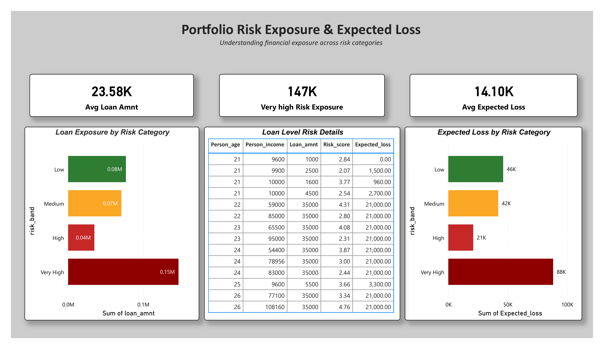
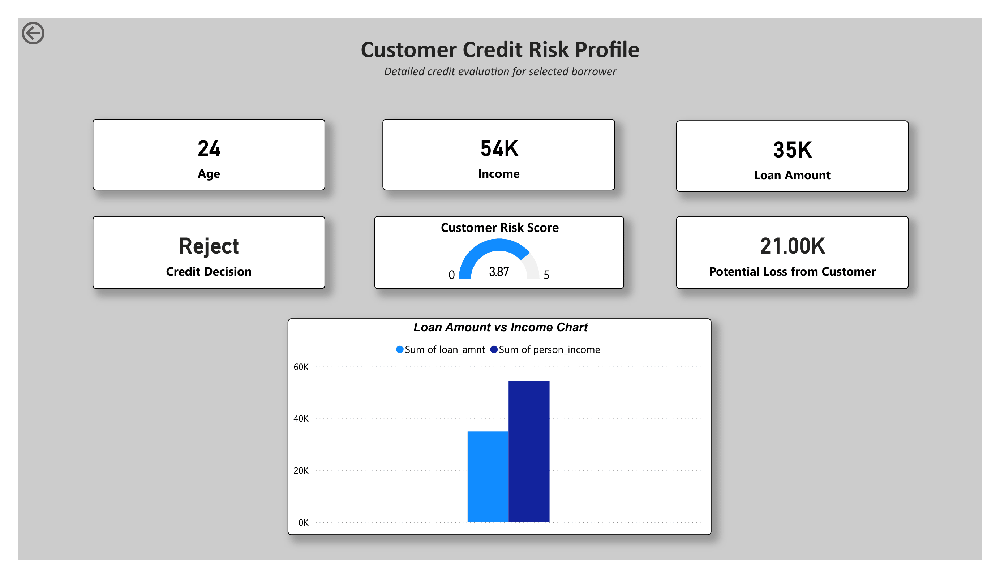
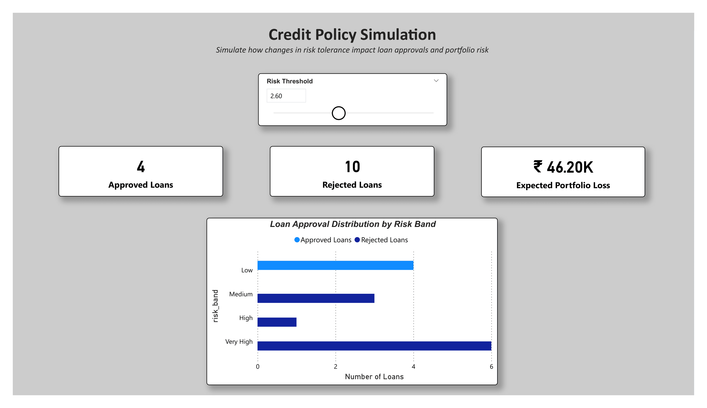

# BNPL Credit Risk Analytics Dashboard

End-to-end BNPL credit risk analytics project built using Microsoft Power BI, SQL, and Python.  
The dashboard analyzes loan portfolio exposure, credit risk distribution, expected loss, and simulates credit policy decisions using an interactive risk threshold model.

This project was independently developed using a publicly available dataset from Kaggle.

---

## Dashboard Preview

### Portfolio Overview


### Risk Intelligence


### Portfolio Monitoring


### Customer Risk Profile


### Credit Policy Simulation


---

## Tech Stack

- Python – Data cleaning and feature engineering  
- SQL – Risk data mart creation and analytical queries  
- Microsoft Power BI – Interactive dashboard and visualization  
- DAX – Portfolio risk metrics and simulation measures  

---

## Dashboard Modules

### 1. Portfolio Overview
- Total Exposure  
- Portfolio Default Rate  
- Expected Portfolio Loss  
- Approval Rate  

Provides a high-level view of the BNPL loan portfolio.

---

### 2. Risk Intelligence
- Default Rate by Risk Category  
- Risk Score Distribution  
- Income Segment vs Risk Category  

Helps identify the key drivers influencing credit risk.

---

### 3. Portfolio Monitoring
- Loan Exposure by Risk Band  
- Expected Loss by Risk Category  
- Loan Level Risk Details  

Used to monitor financial exposure across different risk segments.

---

### 4. Customer Risk Profile
- Drillthrough borrower-level analysis  
- Customer income, loan amount, and risk score  
- Loan vs Income comparison  

Supports detailed evaluation of individual borrower risk.

---

### 5. Credit Policy Simulation
- Risk Threshold slider to simulate credit approval policies  
- Shows approved loans and rejected loans  
- Estimates expected portfolio loss under different policy scenarios  

Demonstrates how risk policy changes affect loan approvals and portfolio risk.

---

## Key Insights

- **Total Portfolio Exposure:** ₹330K  
- **Portfolio Default Rate:** 7.14%  
- **Approval Rate:** 57%  
- **Expected Portfolio Loss:** ₹197K  

---

## Dataset Source

The dataset used in this project is sourced from Kaggle and was used to simulate a BNPL credit risk analytics scenario.

Data processing and feature engineering were performed using Python to create additional fields such as:

- Risk Score  
- Risk Band  
- Expected Loss  
- Credit Decision  

---

## Repository Structure

```
bnpl-credit-risk-analytics-dashboard
│
├── data
│   ├── credit_risk_dataset.csv
│   ├── bnpl_risk_featured.csv
│   └── Readme.md
│ 
├── python
│   ├── Credit_risk.ipynb
│   └── Readme.md
│
├── sql
│   ├── risk_data_mart.sql
│   └── Readme.md
│
├── powerbi
│   ├── BNPL_Risk_Analytics_Dashboard.pbix
│   └── readme.md
│
├── screenshots
│   ├── overview.png
│   ├── risk_intelligence.png
│   ├── portfolio_monitoring.png
│   ├── customer_profile.png
│   └── policy_simulation.png
│
└── README.md
```

---

## Author

**Priyanka Raju**

Data Analyst | SQL | Python | Power BI | Tableau
